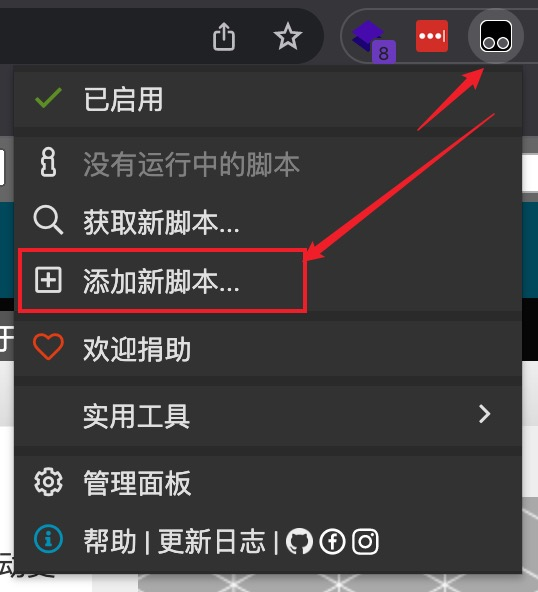
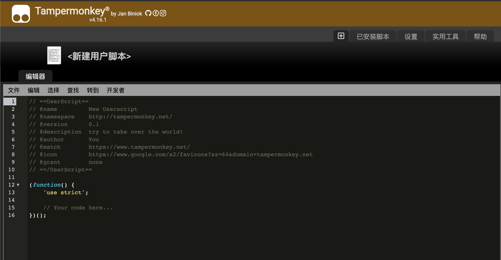
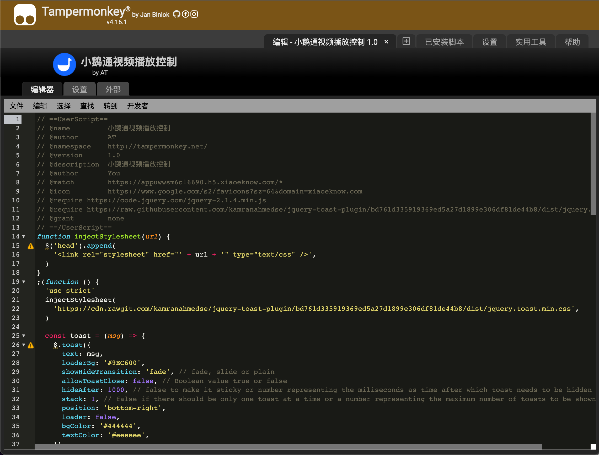
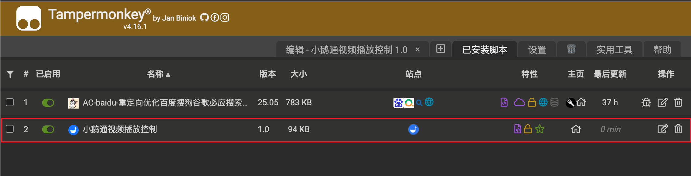

### 介绍

pc 端支持快捷键操作小鹅通视频。本脚本基于 [tampermonkey](https://www.tampermonkey.net/)。建议使用 chrome 浏览器安装 tampermonkey 扩展。

### 功能

- 播放/暂停 **Space**
- 前进 **ArrowRight**
- 后退 **ArrowLeft**
- 全屏 **Escape**
- 提速 **c**
- 降速 **x**
- 还原速度 **z**

#### 进入全屏/退出全屏

使用快捷键 Escape

#### 提速

通过快捷键 c, 可以提升速度, 每次 0.1

#### 降速

使用快捷键 x, 可以降低速度, 每次 0.1

#### 还原速度

使用快捷键 z, 可以还原速度为 1.0

### 安装

在油猴中添加脚本：将 index.js 文件中的代码 copy 进去保存即可，操作如下。添加完成就可以立即使用了。

- 第一步
  
- 第二步
  
- 第三步
  
- 第四步
  
